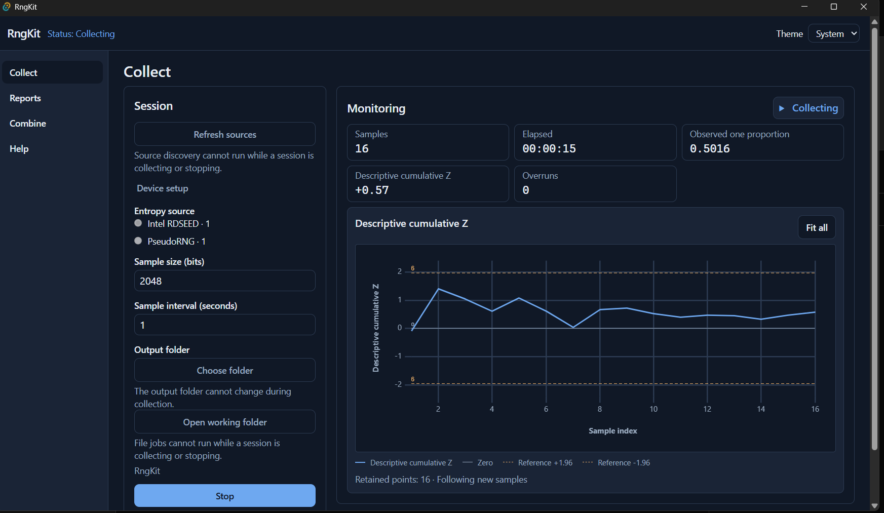
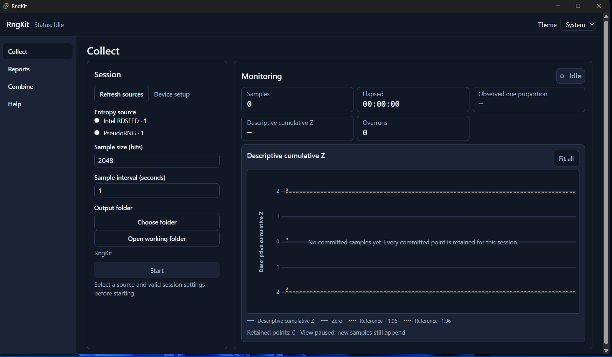
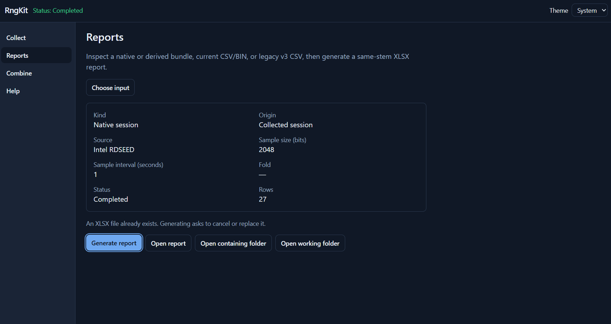
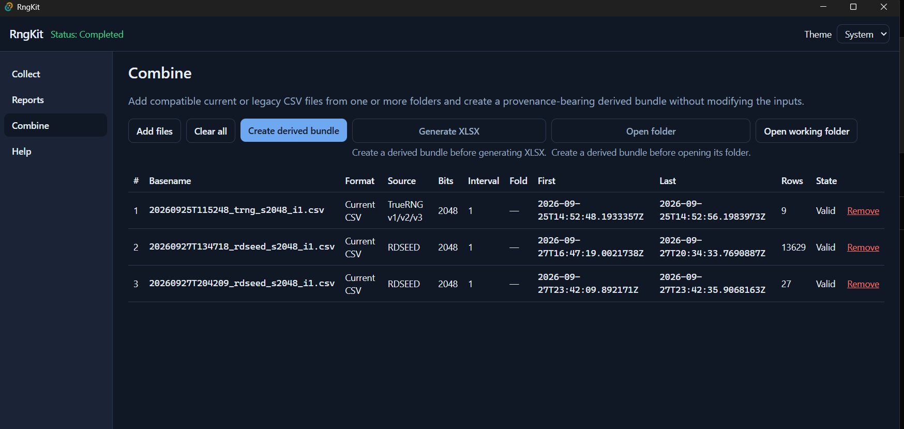
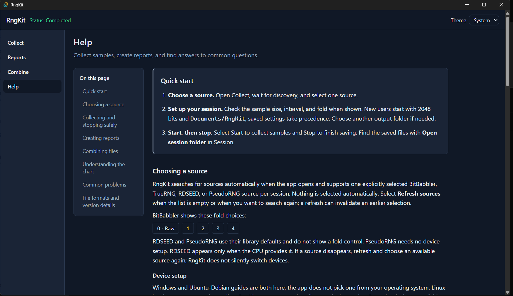

# RngKit

RngKit is a desktop app for recording data from a random number generator and
reviewing it afterwards. You pick one source (a BitBabbler or TrueRNG USB
device, your CPU's RDSEED instruction, or a built-in pseudo-random generator),
and RngKit reads a fixed-size sample at a regular interval (2048 bits every
second by default), counts the ones in each sample, and draws a live cumulative
Z-score chart while it saves everything to disk. Finished sessions can be turned
into Excel (XLSX) reports, and compatible recordings can be merged into one
combined dataset. It is meant for anyone running collection sessions with a
TRNG, including users with files from the older RngKitPSG v3 format, which
RngKit can still read. RngKit is Windows-first; a Linux `.deb` is also provided.



## Features

The app has four screens, reachable from the left-hand navigation.

### Collect



- Sources are discovered automatically when the app opens. Nothing is selected
  for you: choose one source per session, or select **Refresh sources** to
  search again.
- Set the sample size in bits (a multiple of 8; default 2048), the interval in
  whole seconds (default 1), the fold for BitBabbler (0 - Raw, 1, 2, 3, or 4),
  and the output folder (default `Documents/RngKit`). Settings are remembered
  between launches.
- While collecting, the Monitoring panel shows samples, elapsed time, observed
  one proportion, descriptive cumulative Z, and timing overruns, plus a live
  chart with a zero line and ±1.96 reference lines. You can zoom and pan; **Fit
  all** shows the whole session. Every point of the session is kept.
- **Stop** lets the current sample finish and save. If you close the window
  while collecting, RngKit asks whether to keep collecting or stop and exit.

> Z shows balance over time; it does not certify randomness. The ±1.96 lines
> are visual guides only, not a pass/fail test.

### Reports



- Select **Choose input** and pick a file from a recorded session, a combined
  (derived) bundle, a current CSV or BIN file, or a legacy RngKitPSG v3 CSV or
  BIN file.
- Review the preview, then select **Generate report**. RngKit writes an XLSX
  file with the same name, next to the input.
- An existing report is never overwritten silently: **Cancel** keeps it and
  **Replace** is a separate, explicit choice.
- Input files are only read, never changed.

### Combine



- Select **Add files** to pick CSV files, and repeat to add files from other
  folders. Current CSVs, legacy v3 CSVs, or a mix are accepted; BIN files are
  not.
- Each row shows format, source, sample size, interval, fold, time range, row
  count, and whether it is valid. Use **Remove** or **Clear all** to adjust the
  selection.
- Files can be combined only when sample size and interval match exactly and
  their time ranges do not overlap. Sources and folds may differ; such output is
  labeled "Mixed sources". Files are joined in time order; values are not XOR'd
  or resampled.
- **Create derived bundle** writes the combined data to a new folder, then
  **Generate XLSX** creates its report. Your input files are unchanged.

### Help



- A built-in guide covering quick start, choosing a source, device setup,
  collecting and stopping safely, creating reports, combining files,
  understanding the chart, common problems, and file formats.
- **Open device setup folder** opens the driver and permission kit that ships
  with the app (see [Device setup](#device-setup)).
- Choose a System, Light, or Dark theme in the top bar.

## Supported sources

RngKit supports exactly one of these sources per session:

| Source           | What it is                                                                              | Setup needed                                          |
| ---------------- | --------------------------------------------------------------------------------------- | ----------------------------------------------------- |
| BitBabbler       | USB hardware RNG, USB ID `0403:7840`. Supports fold 0 (raw) to 4.                       | Windows: WinUSB driver. Linux: USB permissions.       |
| TrueRNG v1/v2/v3 | USB hardware RNG, USB ID `04d8:f5fe` (not TrueRNGpro).                                  | Windows: CDC/`usbser` driver. Linux: tty permissions. |
| Intel RDSEED     | Hardware random instruction built into the CPU. Appears only when your CPU provides it. | None                                                  |
| PseudoRNG        | Software pseudo-random generator.                                                       | None                                                  |

If a device disappears, refresh and choose a source again; RngKit never
switches devices on its own.

## Installation

Download the latest version from the
[Releases page](https://github.com/Thiagojm/rngkit-tauri/releases/latest).

- **Windows 10/11 (x64):** run `RngKit_<version>_x64-setup.exe`. It installs
  for the current user only. The installer is not signed, so Windows may show a
  warning. If Microsoft WebView2 is missing, setup downloads and installs it,
  which needs an internet connection.
- **Linux (amd64, Ubuntu/Debian):** install the `.deb` with
  `sudo apt install ./RngKit_<version>_amd64.deb`. The package depends on
  `libusb-1.0-0` and does not install device permission (udev) rules; see
  below. Formal Linux hardware validation is still pending.

Each release also includes `SHA256SUMS.txt` for checking your download.

### Device setup

Hardware devices need a one-time driver or permission setup. The files are
bundled with the app: open **Help → Choosing a source → Device setup** and
select **Open device setup folder**. RngKit never runs these tools for you.

- **Windows / BitBabbler:** run the bundled `zadig-2.9.exe`, enable Options →
  List All Devices, select the device with USB ID `0403:7840`, and install
  **WinUSB** for it (not the FTDI VCP driver, and not for any other FTDI
  device). Unplug and reconnect.
- **Windows / TrueRNG:** Windows often uses its built-in CDC / `usbser` driver.
  If the device is not available, get the manufacturer driver package from
  [euler357/TrueRNG](https://github.com/euler357/TrueRNG) (`Windows_Drivers`);
  it is not bundled. Do not bind WinUSB to this device. Unplug and reconnect.
- **Ubuntu / Debian:** from the kit's `linux` folder, check and then apply the
  permission rules (replace `bitbabbler` with `truerng3` or `both` as needed):

  ```text
  bash setup-rng-devices.sh --check --device bitbabbler --user YOUR_USER
  sudo bash setup-rng-devices.sh --device bitbabbler --user YOUR_USER
  ```

  Then log out and back in and reconnect the device.

After setup, select **Refresh sources** in Collect and run a short Start/Stop
to confirm a session is saved.

## Quick start

1. **Connect your device.** Plug in your BitBabbler or TrueRNG (complete
   [Device setup](#device-setup) the first time). RDSEED and PseudoRNG need no
   device.
2. **Pick a source.** Open RngKit on the **Collect** screen, wait for discovery
   (or select **Refresh sources**), and select one source.
3. **Check your settings.** Sample size, interval, fold (BitBabbler only), and
   output folder.
4. **Start.** Select **Start** and watch the samples and the cumulative Z chart
   update.
5. **Stop.** Select **Stop** and wait while the last sample is saved. Use **Open
   session folder** to see the files.
6. **Generate a report.** Go to **Reports**, select **Choose input**, pick the
   session's CSV file, and select **Generate report**. Open the XLSX from the
   result dialog.

## Output files

Every session is saved in its own folder inside your output folder (default
`Documents/RngKit`). The folder and its files share one name:

```text
<YYYYMMDDTHHMMSS>_<source>_s<bits>_i<seconds>[_f<fold>]
```

The timestamp is the local start time, `<source>` is `bitb`, `trng`, `rdseed`,
or `pseudo`, and `_f<fold>` appears only for BitBabbler. Example:
`20260927T154500_trng_s2048_i1`.

| File            | Contents                                                                                                                                                                                                        |
| --------------- | --------------------------------------------------------------------------------------------------------------------------------------------------------------------------------------------------------------- |
| `<name>.bin`    | The raw sample bytes, in order.                                                                                                                                                                                 |
| `<name>.csv`    | One row per sample: `sample_index`, `captured_at_utc` (RFC 3339), `elapsed_ms`, `acquisition_ms`, `ones`, `byte_offset`, `byte_length`.                                                                         |
| `manifest.json` | Session metadata.                                                                                                                                                                                               |
| `<name>.xlsx`   | Created by Reports. A **Summary** sheet (source, fold, sample bits, interval, start/end, samples, ones, proportion, descriptive final Z, overruns, and more) and a **Samples** sheet with a cumulative Z chart. |

**Combine** creates a new derived-bundle folder in your output folder with the
combined CSV and a `manifest.json` that records the inputs (without their
absolute paths). **Generate XLSX** saves the report in that folder.

Reports for standalone or legacy files are saved next to the chosen file, with
the same name and an `.xlsx` extension.

## Development

Requirements: Node.js `^20.19.0 || >=22.12.0`, npm `>=10`, and Rust (edition
2024, MSRV 1.85). The app uses Tauri 2, Svelte 5, TypeScript, Vite, Tailwind
CSS 4, and uPlot; the Rust side builds on
[rngkit-core](https://github.com/Thiagojm/rngkit-core). Exact versions are
locked in `package-lock.json` and `src-tauri/Cargo.lock`.

```text
npm ci
npm run tauri dev
```

Frontend-only checks:

```text
npm run check
npm run lint
npm run format:check
npm run test:unit -- --run
npm run test:e2e
npm run build
```

Physical-device tests for BitBabbler, TrueRNG, RDSEED, and discovery live in
`src-tauri/tests/hardware.rs`. They are ignored by default and never run in
normal test runs.

`.github/workflows/ci.yml` runs locked frontend and Rust checks on Windows and
Ubuntu, then `npm run tauri -- build --no-bundle -- --locked`. It does not run
ignored physical tests or build an installer.

`.github/workflows/release.yml` does **not** run on ordinary commits. It builds
installers only for tags `v*` (draft GitHub Release) or manual
`workflow_dispatch` (Actions artifacts). Tag runs require `v<version>` to match
`package.json`, `src-tauri/tauri.conf.json`, `src-tauri/Cargo.toml`, and the
lockfiles, plus a successful `ci.yml` run on that exact SHA. Branch dispatch
checks the same files and SHA without a tag. Publishing the draft is a separate
click. Ubuntu packaging is not Linux hardware acceptance.

## Packaging

v1 ships an unsigned per-user English NSIS installer (`.exe`) without embedded
WebView2. Setup downloads and installs WebView2 if missing, requiring internet
in that case. This replaces the offline installer (about 203 MB extra in the
2026-09-11 payload). Linux uses an amd64 `.deb` built on Ubuntu 22.04.
The `.deb` does not install udev rules. Signing,
SmartScreen, updater, and Store remain out of scope. Uninstall must leave user
session output intact.

```text
npm run tauri -- build --bundles nsis -- --locked
npm run tauri -- build --bundles deb -- --locked
```

Build sizes, checksums, and installer test evidence are recorded in
[`docs/PROJECT_CONTEXT.md`](docs/PROJECT_CONTEXT.md).

## Project history

Current state, validation evidence, and the previous README status notes are in
[`docs/PROJECT_CONTEXT.md`](docs/PROJECT_CONTEXT.md). Durable decisions are in
[`docs/DECISIONS.md`](docs/DECISIONS.md), the roadmap is in [`TODO.md`](TODO.md),
and design specs and plans are under `docs/specs/` and `docs/plans/`.

## License

MIT. See [`LICENSE`](LICENSE).
